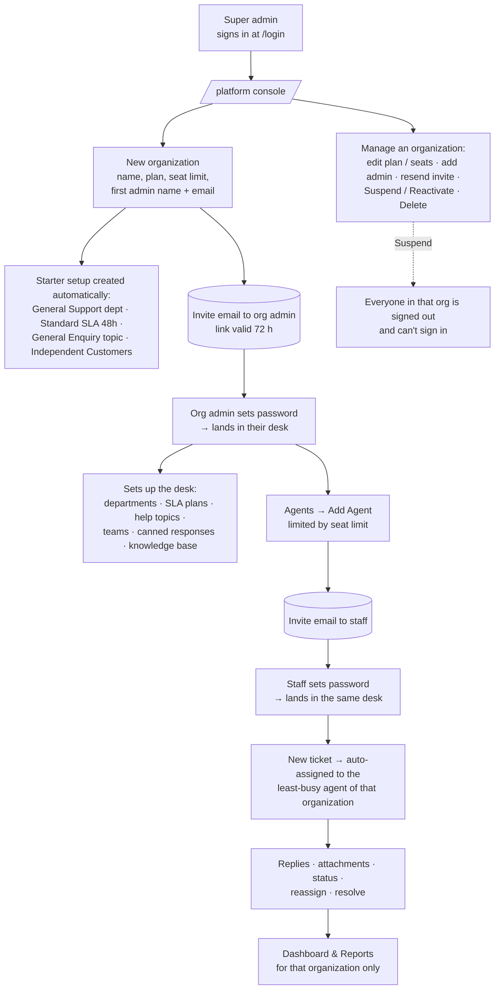

# Threadline Platform — Usage Flow & Step-by-Step Production Test

Threadline is a platform you sell to many client organizations. There are three kinds of users:

| Who | How the account is made | Where they land after `/login` |
| --- | --- | --- |
| **Super admin** — you | `SUPER_ADMIN_EMAIL` / `SUPER_ADMIN_PASSWORD` in Vercel | `/platform` (the platform console) |
| **Organization admin** — your customer | You create them together with their organization in `/platform` | Their own help desk |
| **Staff (agent)** — your customer's employees | The organization admin adds them in **Agents → Add Agent** | Their own help desk |

Every organization is a separate desk: an organization can never see another organization's tickets, customers,
agents, articles or files. There is no public sign-up — everyone joins through an invite email.

> **This is your live database.** Everything you create is real data. Create test organizations with names
> starting with `[TEST]` and delete them in Part 9. Deleting an organization removes all of its data.

---

## 1. Usage flow



### What each person sees

- **Super admin:** only `/platform`. A list of organizations with plan, seats used and ticket counts. If you
  open a desk page such as `/tickets`, you're sent back to `/platform`.
- **Org admin:** the normal desk (Dashboard, Tickets, Customers, Agents, and so on) holding only their
  organization's data. The sidebar shows the organization's name under the logo. **Settings → Organization**
  shows the plan and "X of Y seats used". Only you can change the plan and seat limit, not the org admin.
- **Staff:** the same desk, but without admin actions (they can't add agents or change organization settings).

---

## 2. Before you deploy (one time)

In **Vercel → your project → Settings → Environment Variables** (Production):

| Variable | Value |
| --- | --- |
| `SUPER_ADMIN_EMAIL` | Your own email, e.g. `owner@yourcompany.com`. **It must not be an agent's email in any organization.** |
| `SUPER_ADMIN_PASSWORD` | 8+ characters with a letter and a number |
| `SUPER_ADMIN_NAME` | Optional, e.g. `Muhammad Irfan` |
| `SESSION_SECRET` | Already set (`openssl rand -base64 32`) |
| `APP_URL` | Your production URL, e.g. `https://your-app.vercel.app` (no trailing slash) — used in invite links |
| `SMTP_USER` + `SMTP_PASS` | Gmail address + [Google App Password](https://myaccount.google.com/apppasswords), so invites are really emailed |

You can **remove `ADMIN_EMAIL`, `ADMIN_PASSWORD` and `ADMIN_NAME`**; they're no longer used.

Then deploy (push to `main`, or run `vercel --prod`). In the build log (Vercel → Deployments → the deployment →
**Building**) you should see:

```
[db:neon] migrations applied
[db:neon] created super admin owner@yourcompany.com      ← or "is up to date"
```

**If you already had data:** the migration moves it into **organization #1**, named after the old workspace
name, so your existing admin and agents keep working. In `/platform` it's the organization with all the tickets.

> Forgot the super admin password? Change `SUPER_ADMIN_PASSWORD` in Vercel and redeploy. The build updates it.

**Get ready for testing:**
- Two or three mailboxes you can read. Gmail aliases work: `you+acmeadmin@gmail.com`, `you+acmeagent@gmail.com`,
  `you+betaadmin@gmail.com`.
- Three browser windows, so three people can be signed in at once: a normal window (super admin), a private
  window (Acme users), and a different browser or profile (Beta users).
- Keep **Vercel → Logs** open in a tab, to catch server errors.

Fill in as you go:

| | Value |
| --- | --- |
| Production URL | `https://______________________` |
| Super admin email | |
| Acme admin email | |
| Acme agent email | |
| Beta admin email | |
| Tester / date | |

---

## Part 1 — Super admin sign-in (5 min)

| # | Step | Expected result | ✓ |
| --- | --- | --- | --- |
| 1.1 | Open the production URL | You're sent to `/login` | ☐ |
| 1.2 | Sign in with the **wrong** super admin password | "Incorrect email or password" | ☐ |
| 1.3 | Sign in with `SUPER_ADMIN_EMAIL` / `SUPER_ADMIN_PASSWORD` | You land on **/platform** with the "Platform console" badge, showing Organizations and three stat cards | ☐ |
| 1.4 | In the address bar, open `/tickets` | You're sent back to `/platform` (the super admin has no desk) | ☐ |
| 1.5 | Open `/login` again | You're sent to `/platform` (already signed in) | ☐ |
| 1.6 | If you had data before: look at the list | Your old workspace is listed with its agents and tickets | ☐ |

---

## Part 2 — Create the first organization (10 min)

| # | Step | Expected result | ✓ |
| --- | --- | --- | --- |
| 2.1 | Click **New organization** | A form opens | ☐ |
| 2.2 | Click **Create organization** with the form empty | Each required field shows a red error; nothing is created | ☐ |
| 2.3 | Fill in: Name `[TEST] Acme`, Support email `support@acme.test`, Plan `Starter`, **Seat limit `2`**, Time zone any, Admin name `Acme Admin`, Admin email = your *Acme admin* mailbox | — | ☐ |
| 2.4 | Click **Create organization** | "Organization created" dialog. If email is set up: "An invite … was emailed to …". If not: an amber warning plus the invite link with a **Copy** button | ☐ |
| 2.5 | Close the dialog | `[TEST] Acme` is at the top of the list: plan Starter, seats `1 / 2`, 0 tickets, status **Active** | ☐ |
| 2.6 | Try to create another organization named `[test] acme` (different case) | Error "An organization with this name already exists" | ☐ |
| 2.7 | Try to create an organization whose admin email is an **existing agent's** email | Error "This email already belongs to an agent"; no half-created organization appears in the list | ☐ |
| 2.8 | Try to create one whose admin email is **your super admin email** | Error "This email is already in use"; nothing is created | ☐ |
| 2.9 | Click `[TEST] Acme` in the list | The detail page shows stats, "Subscription & details", the People list with *Acme Admin — Admin — **Invited***, and the Danger zone | ☐ |

---

## Part 3 — Organization admin accepts the invite (10 min)

Use the **private window** for this part.

| # | Step | Expected result | ✓ |
| --- | --- | --- | --- |
| 3.1 | Open the invite email (subject "… invited you to [TEST] Acme on Threadline"), or paste the copied link | The Set-password page opens. The link starts with your `APP_URL` | ☐ |
| 3.2 | Enter a weak password such as `abc` | Rejected (8+ characters, a letter and a number) | ☐ |
| 3.3 | Set a valid password | You're signed in and land on the **Dashboard** | ☐ |
| 3.4 | Look under the logo in the sidebar | It shows **[TEST] Acme** | ☐ |
| 3.5 | Open **Tickets, Customers, Agents, Knowledge Base, Reports** | All empty. **You must NOT see any other organization's data.** Agents lists only Acme Admin | ☐ |
| 3.6 | Open **Departments, SLA Plans, Help Topics, Organizations** | Starter records only: *General Support*, *Standard SLA (48h)*, *General Enquiry*, *Independent Customers* | ☐ |
| 3.7 | **Settings → Organization** | Name `[TEST] Acme`, "Plan: Starter · 1 of 2 seats used"; you can edit the name, support email and time zone | ☐ |
| 3.8 | Sign out, then open the same invite link again | The page says the link is invalid or expired (links work once) | ☐ |
| 3.9 | Back in the **super admin** window, refresh the Acme page | Acme Admin now shows as **Active**; no "Resend invite" button | ☐ |
| 3.10 | In the private window, open `/platform` | You're sent back to the Dashboard; org admins can't open the console | ☐ |

---

## Part 4 — Organization admin adds staff and the seat limit (10 min)

Still in the private window, as **Acme Admin**.

| # | Step | Expected result | ✓ |
| --- | --- | --- | --- |
| 4.1 | **Agents → Add Agent**: name `Acme Agent`, email = your *Acme agent* mailbox, department General Support, role Agent, not admin | Created; toast says an invite was emailed. Seats are now 2 / 2 | ☐ |
| 4.2 | Add one more agent (any test email) | Refused: "Your plan allows 2 active agents. Deactivate someone or ask your provider for more seats." | ☐ |
| 4.3 | **Super admin window:** on the Acme page set **Seat limit** to `5` → **Save** | "Organization saved"; stats show `x / 5` | ☐ |
| 4.4 | Private window: add the extra agent again | Now it works | ☐ |
| 4.5 | Try to add an agent with an email that already exists in *another* organization, e.g. `nadia@northwind.test` or an agent from organization #1 | Refused: that email is already used | ☐ |
| 4.6 | Open the *Acme agent* invite email in a **third browser or profile**, set a password | Signed in to the **[TEST] Acme** desk as a regular agent | ☐ |
| 4.7 | As the agent: open Agents | No "Add Agent" button. Editing someone else is refused. Settings → Organization is read-only | ☐ |

---

## Part 5 — Daily work inside an organization (15 min)

As **Acme Admin** or **Acme Agent**.

| # | Step | Expected result | ✓ |
| --- | --- | --- | --- |
| 5.1 | **Departments → Add**: `Technical Support` | Created, even though organization #1 may already have a department with that name (names only have to be unique **inside** an organization) | ☐ |
| 5.2 | **SLA Plans → Add**: `[TEST] 4h`, 4 hours. **Help Topics → Add**: `Login issue` → Technical Support + `[TEST] 4h` | Created | ☐ |
| 5.3 | **Tickets → New**: customer `Zara`, `zara@client.test`, topic `Login issue`, priority High, subject `Can't sign in` | Created; assigned to an **Acme** agent (never someone from another organization); due in about 4 hours | ☐ |
| 5.4 | **Customers** | Zara appears under *Independent Customers* | ☐ |
| 5.5 | As the assignee: the bell icon | "… assigned to you" notification within about 30 seconds | ☐ |
| 5.6 | Reply with text plus an image attachment | Reply shown; the attachment downloads | ☐ |
| 5.7 | Change status to Resolved | Dashboard and Reports count it (Acme numbers only) | ☐ |
| 5.8 | **Global search** for `Zara`, then for a word from one of organization #1's tickets | Zara is found; **the other organization's tickets are not** | ☐ |
| 5.9 | Knowledge Base: add a category and an article; add a canned response and use it in a reply | Works | ☐ |

---

## Part 6 — Isolation between two organizations (most important, 15 min)

Create a second organization and confirm the two can't see each other.

| # | Step | Expected result | ✓ |
| --- | --- | --- | --- |
| 6.1 | Super admin: **New organization** `[TEST] Beta` with your *Beta admin* mailbox. Accept the invite in a browser where no one else is signed in | Beta Admin lands in an **empty** Beta desk | ☐ |
| 6.2 | As Beta Admin: Tickets, Customers, Agents, Knowledge Base, Reports, Search | **Nothing** from Acme or organization #1 | ☐ |
| 6.3 | As **Acme**: open the ticket from 5.3 and copy its URL, e.g. `/tickets/9123` | — | ☐ |
| 6.4 | As **Beta**: paste that URL | "Ticket not found". The ticket number isn't visible | ☐ |
| 6.5 | As **Acme**: right-click the attachment from 5.6 → copy link. As **Beta**: open it | 404, not the file | ☐ |
| 6.6 | Repeat 6.3–6.4 with a customer (`/customers/<id>`) and a KB article (`/knowledge-base/<id>`) | Not found for Beta | ☐ |
| 6.7 | As **Beta**: create a department named `Technical Support` | Allowed; Acme's one is unaffected | ☐ |
| 6.8 | As **Beta**: new ticket with topic `General Enquiry` | Assigned to **Beta Admin**, never to an Acme agent | ☐ |
| 6.9 | Super admin list | Each organization shows only its own agents and tickets | ☐ |

Optional API check from a terminal (replace the URL, and use an Acme ticket id for `ID`):

```bash
URL=https://your-app.vercel.app
curl -s -c beta.txt -H 'Content-Type: application/json' \
  -d '{"email":"BETA_ADMIN_EMAIL","password":"BETA_PASSWORD"}' $URL/api/auth/login > /dev/null
curl -s -o /dev/null -w "%{http_code}\n" -b beta.txt $URL/api/tickets/ID      # expect 404
curl -s -o /dev/null -w "%{http_code}\n" -b beta.txt $URL/api/platform/tenants # expect 401
rm beta.txt
```

If Vercel **Deployment Protection** is on, curl gets a Vercel login page instead; test in the browser.

---

## Part 7 — Super admin management (10 min)

| # | Step | Expected result | ✓ |
| --- | --- | --- | --- |
| 7.1 | Acme page → **Add admin** with a new test email | "Invite sent" dialog; the person appears as Admin — Invited | ☐ |
| 7.2 | Click **Resend invite** on that person | A new link is emailed (or shown); **the old link stops working** | ☐ |
| 7.3 | Edit Acme's plan to `Business` → Save | The list and the org admin's Settings → Organization show Business | ☐ |
| 7.4 | Click **Suspend** → confirm | Status shows **Suspended** | ☐ |
| 7.5 | In the Acme windows, click any page | Signed out, back to `/login` | ☐ |
| 7.6 | Try to sign in as Acme Admin | "Your organization's account is suspended. Contact your provider." | ☐ |
| 7.7 | Try **Forgot password** for an Acme user | Same generic message as always, but no email arrives while suspended | ☐ |
| 7.8 | Beta and organization #1 users while Acme is suspended | Unaffected | ☐ |
| 7.9 | Click **Reactivate** | Acme users can sign in again; all data is still there | ☐ |

---

## Part 8 — Accounts and security (10 min)

| # | Step | Expected result | ✓ |
| --- | --- | --- | --- |
| 8.1 | Signed out, open `/signup` | Sent to `/login`; there's no public sign-up page, and the login page says to ask your administrator for an invite | ☐ |
| 8.2 | Signed out, open `/api/tickets` and `/api/platform/tenants` | Both return `401 {"message":"You need to sign in"}` (or similar) | ☐ |
| 8.3 | Acme Admin: **Forgot password** → email → set a new password | Signed in to Acme | ☐ |
| 8.4 | Settings → Security: change password while signed in on two browsers | The other browser is signed out | ☐ |
| 8.5 | While signed in as an Acme user, open `/login` | You're sent back to the desk. To switch accounts, **sign out first**; signing in as someone else replaces the old session (one identity per browser) | ☐ |
| 8.6 | Wrong password 10+ times for one email within 15 minutes | "Too many attempts. Try again in N minutes." (Only do this with a test account.) | ☐ |

---

## Part 9 — Clean up

| # | Step | Expected result | ✓ |
| --- | --- | --- | --- |
| 9.1 | Super admin → `[TEST] Beta` → **Delete organization** | The Delete forever button stays disabled until you type the exact name | ☐ |
| 9.2 | Type `[TEST] Beta` → **Delete forever** | Back on the list; Beta is gone. Its users can no longer sign in | ☐ |
| 9.3 | Do the same for `[TEST] Acme` | Gone, including its tickets and files | ☐ |
| 9.4 | Organization #1 (your real/old data) | Untouched | ☐ |

---

## Quick smoke test after every deploy (3 min)

1. `/login` → super admin → `/platform` shows your organizations.
2. Private window → an org admin signs in → Dashboard loads, the sidebar shows their organization's name.
3. Open Tickets and one ticket. Reply "smoke test", then delete that reply's ticket if it was a test ticket.
4. No red errors in **Vercel → Logs**.

---

## Troubleshooting

| Symptom | Cause / fix |
| --- | --- |
| Build fails: `SUPER_ADMIN_EMAIL … already belongs to an agent` | Use a super admin email that isn't an agent anywhere (a Gmail alias is fine) |
| Build fails: `SUPER_ADMIN_PASSWORD: …` | The password needs 8+ characters with a letter and a number |
| Super admin sign-in says "Incorrect email or password" | Check the build log said `created super admin …`. The variables must be set for **Production**, and you must redeploy after changing them |
| Invite dialog shows the amber warning | Email isn't configured (`SMTP_USER`/`SMTP_PASS`); copy the link and send it yourself, or set SMTP and use **Resend invite** |
| Invite link points to a `*.vercel.app` preview URL | Set `APP_URL` to your production domain and redeploy |
| Every sign-in fails with a server error | `SESSION_SECRET` is missing in Vercel |

## Reporting a bug

For each failure note the step number (e.g. `6.5`), URL, which user and organization, what you did, what you
expected, what happened, a screenshot, and the matching error from Vercel → Logs (with the time).

| Step | Result | Notes / error |
| --- | --- | --- |
| | | |
